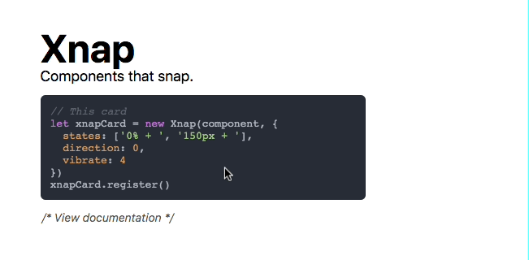

# Xnap

Components that snap.

## Demo
[https://mobooru.github.io/xnap/](https://mobooru.github.io/xnap/)



```
npm i --save xnap
```

## How do i use it?

For a full example, check out /example.
Here's a simple example that snaps between `transformX(-100%)` and `transformX(100%)`.

```js
let xnapCard = new Xnap(component, { states: ['-100% + ', '100% + '], direction: 0 })
xnapCard.register() // Register the event listeners.
```

## Options

```js
new Xnap(component, { options })
```

| Name        | Type         | Default              | Description                                                                                                              |
|-------------|--------------|----------------------|--------------------------------------------------------------------------------------------------------------------------|
| exact       | Boolean      | false                | If dragging should only be triggered when you touch the component xnap was mounted on.                                   |
| state       | Boolean      | false                | Which state the component is initiated with.                                                                             |
| states      | String Array | ['0% + ', '100% + '] | What the transforms are for the states. Movement is appended to the current string.                                      |
| scaleStates | Number Array | [1.0, 1.0]           | What the scales are for the states.                                                                                      |
| factor      | Number       | 5                    | How snappy it is. Higher = Snappier.                                                                                     |
| length      | Number       | 100                  | How far it needs to be dragged before it snaps.                                                                          |
| onTrue      | Function     | None                 | Function that triggers when state is set to true.                                                                        |
| onFalse     | Function     | None                 | Function that triggers when state is set to false.                                                                       |
| direction   | Number       | 1                    | Which direction it moves. 0 = Left/Right. 1 = Up/Down.                                                                   |
| vibrate     | Number       | None                 | If a number is given, it vibrates the device on state change for the given duration in MS. Use 2 - 5 for a clicky tap.   |
